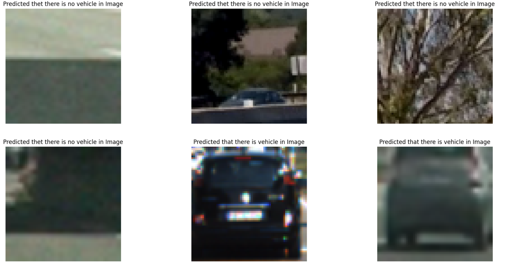
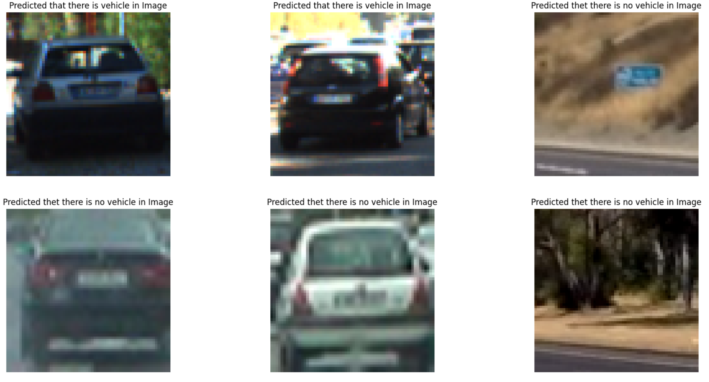
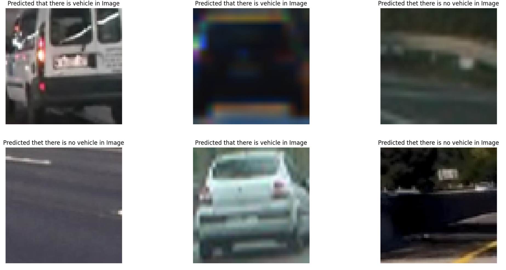

# Vehicle-detection-using-CNN
This repo contains the dataset and code of my final year project "Vehicle detection using CNN" as partial fulfillment of Msc in IT from the department of computer science, gauhati university

## Dataset
I used a publicly available dataset for vehicle and non-vehicle detection. The dataset is available in the `data` directory.

## Notebooks

We trained three different machine learning models to classify vehicle and non-vehicle. For more details about the models and their performance, refer to the project report in the `documentation` directory.

- `Mysequential_CNN.ipynb`: G-colab Notebook for vehicle detection using sequentail personal customized CNN model.
- `vehicleDetection_EffNetB0.ipynb`: G-colab Notebook for vehicle detection using customized efficientNetB0 model.
- `vehicleDetection_VGG16.ipynb`: G-colab Notebook for vehicle detection using  customized VGG16 model.

### Screenshots

## Documentation
The `documentation` directory contains my project proposal, Report and assests. For more detailed information about the project, you can refer to the following documents:

- [Project Report](documentation/project_report.pdf)
- [Assets](documentation/assets)

## How to Use

### Installation

Make sure you have the required version of Python (e.g., Python 3.7 or later) installed before proceeding.

1. To use this project, you need to have Python installed on your system.
   
2. Install the required dependencies using the following command: `pip install -r requirements.txt`

3. Open your terminal, navigate to where you want to save the project and and Clone this repository using `git clone https://github.com/Chid2410/Vehicle-detection-using-CNN`

4. Open and run the Jupyter Notebooks in the `notebooks` directory in the specified order.

## License
This project is licensed under the MIT License - see the [LICENSE](LICENSE) file for details.

Copyright (c) 2023 <Chid> Chidangsha Sekhar Bezbaruah </Chid>
